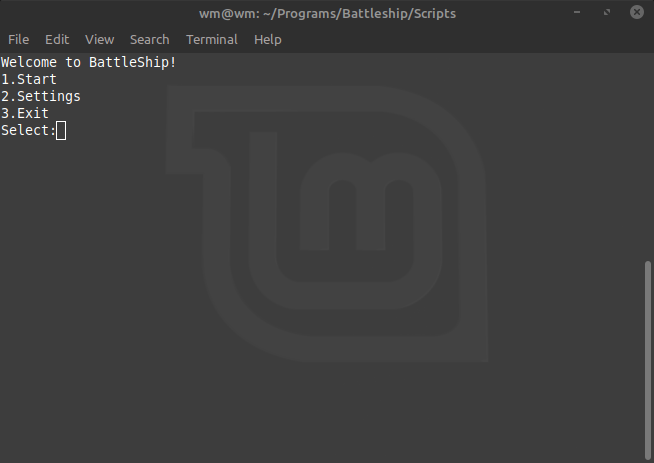
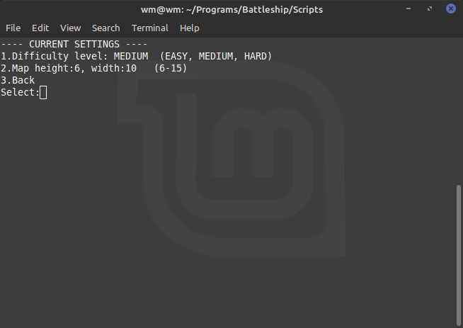
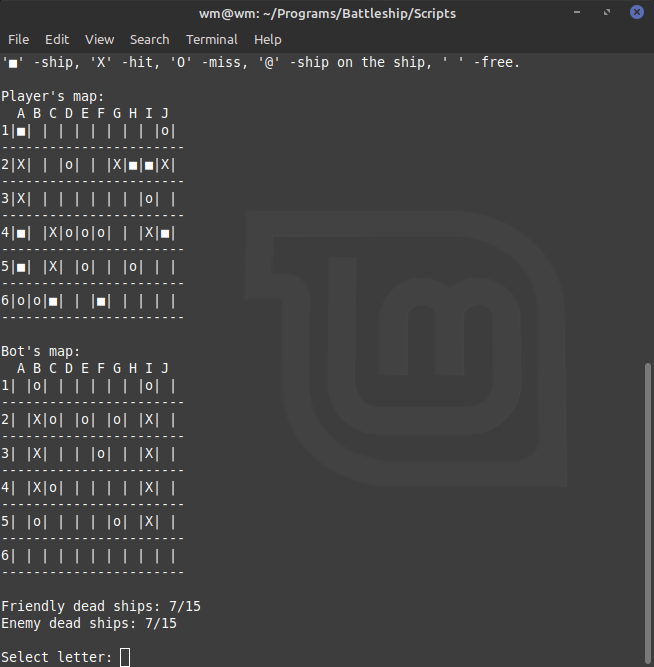

# Battleship
Hello everyone! This is my first bigger project in C++. I have used C++11 standard and STL. The game is all about destroying all enemies' ships. You can play against a bot which randomly generates hits positions depending on the difficulty level. Below you can see some photos from this project

*MENU:

*SETTINGS

*GAMEPLAY

